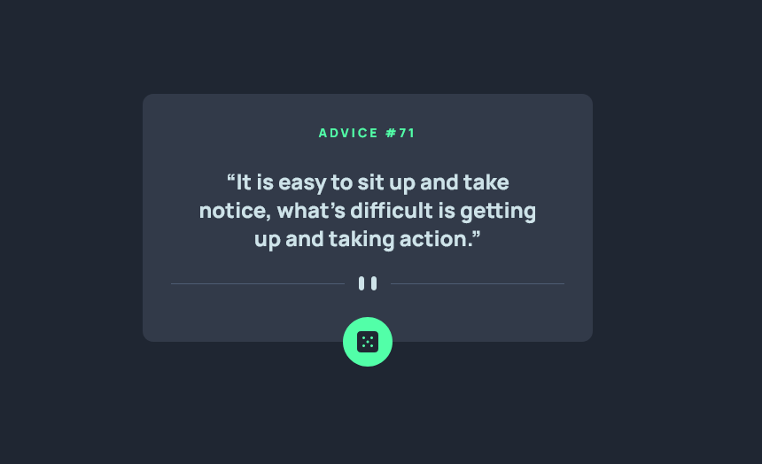

# Advice generator app

This is a solution to the [Advice generator app challenge on Frontend Mentor](https://www.frontendmentor.io/challenges/advice-generator-app-QdUG-13db).

## Table of contents

- [Overview](#overview)
  - [The challenge](#the-challenge)
  - [Screenshot](#screenshot)
  - [Links](#links)
- [Built with](#built-with)
- [Author](#author)

## Overview

### The challenge

Users are able to:

- View the optimal layout for the app depending on their device's screen size
- See hover states for interactive elements on the page
- Generate a new piece of advice by clicking the dice icon

### Screenshot

### Links

- [Solution URL](https://www.frontendmentor.io/solutions/)
- [Live Site URL](https://dyios.github.io/advice-generator/)

## Built with

- Semantic HTML5 markup
- Flexbox
- Mobile-first workflow
- [React](https://reactjs.org/) - JS library
- [MUI](https://mui.com/) - Components library
- [Axios](https://axios-http.com/) - Promise based HTTP client

## Author

- Website - [TOLBA Rafik](https://r-tolba.netlify.app/)
- Frontend Mentor - [@Dyios](https://www.frontendmentor.io/profile/Dyios)
